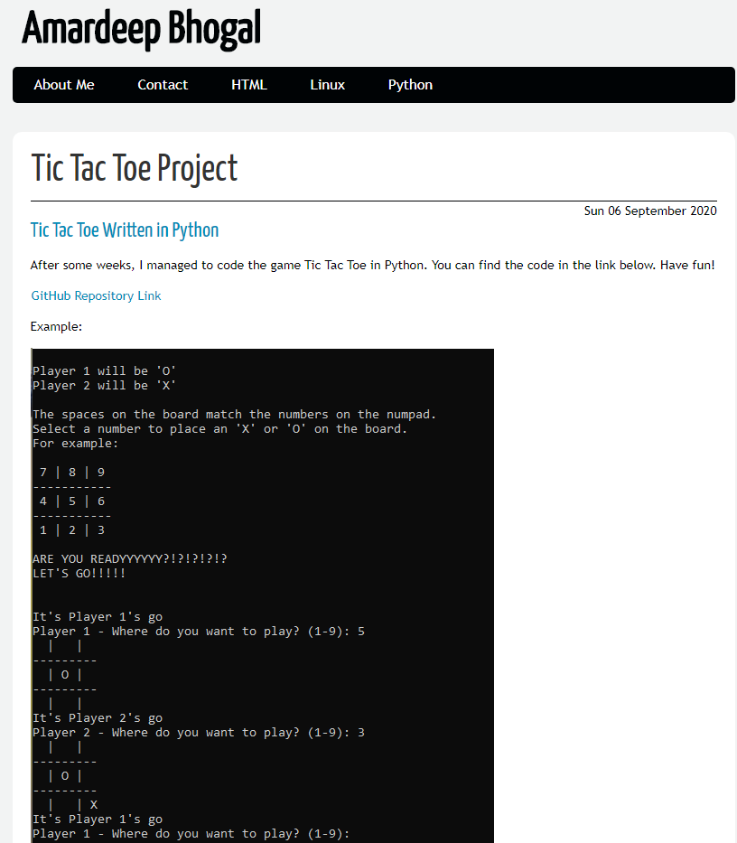

# Creating a Website Portfolio using Pelican

Using Pelican, a static site generator, I began to create a personal website from scratch. This is my first attempt at creating a website so everything I have managed to build so far was, effectively, learning on the job. After much stress, research and time, this is where I have got to currently. I am yet to push the website via GitHub actions, in order to automate the workflow of the website but, that is my next goal.

## Workflow
1. Firstly I installed Pelican using,
```
python -m pip install "pelican[markdown]" 
```

2. Executed pelican-quickstart. I made sure to host on GitHub.

3. I created a page for the About Me section, while also creating articles to describe my projects with Bash and Python.

4. After creating these pages and articles, I created the *images* directory in the *content* directory. In the pelicanconfig.py, I edited STATIC_PATHS = [ 'IMAGES' ].

5. Then, I linked the images required into the repective, pages and articles.

6. The website was, then, ready to be published. Within the output directory,

```
git init
git add .
git commit -m "first commit"
git remote add origin remote repository URL
git remote -v
git push origin master  
```

7. Then push output to GitHub Pages after creating gh-pages branch,
```
git checkout -b gh-pages
git push origin gh-pages
```

8. Finally I decided to create a source branch so the code/content could be viewed also. Within the portfolio directory,
```
git checkout -b source
git init
git add .
git commit -m "source"
git push origin source</code>
```

