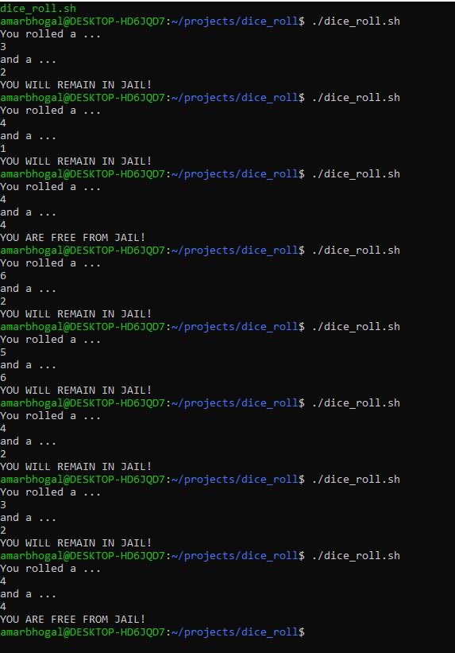

Title: Dice Roll Project
Date: 2020-10-05
Author: Amardeep Bhogal
Category: Linux

## Monopoly Jail Dice Roll

I created a monopoly double dice roll to determine the outcome if a player was stuck in jail on their turn. This simulates the process and determines the outcome of the roll.
Lets see if you can make it out of jail. Find the code in the link below. Good luck!

<a href = "https://github.com/AmarBhogal/monopoly-dice-roll.git">GitHub Repository Link</a>

Example: 

